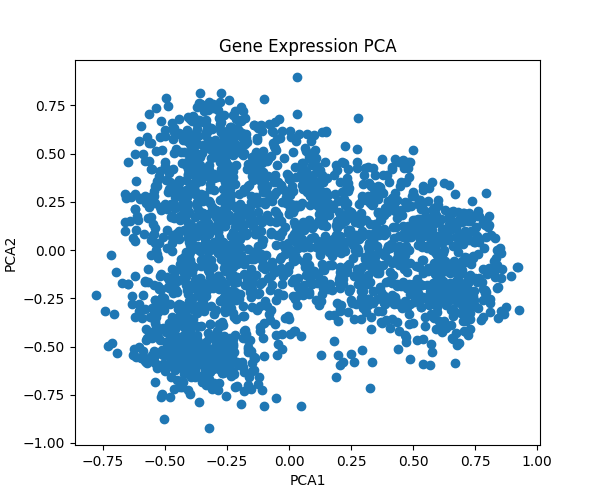
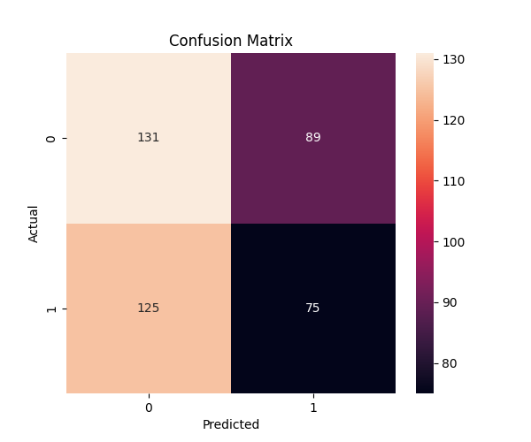

# Machine Learning-Based Cancer Gene Expression Analysis

## Objective
To build a bioinformatics and machine learning workflow for analyzing gene expression datasets and identifying important features.

## Tools & Technologies
- Python
- Pandas
- Scikit-learn
- Matplotlib
- Seaborn
- Bioinformatics datasets (NCBI GEO)
- Google Colab

## Workflow
1. Downloaded public gene expression dataset
2. Preprocessed and cleaned data
3. Handled missing values
4. Split dataset into training and testing sets
5. Built Random Forest classifier
6. Evaluated model performance
7. Applied PCA for dimensionality reduction
8. Identified important gene features

## Code Snippets

### Data Loading

```python
import pandas as pd

data = pd.read_csv(
    "GSE13159_series_matrix.txt",
    sep="\t",
    comment="!",
    header=None
)
```

### Random Forest Model

```python
from sklearn.ensemble import RandomForestClassifier

model = RandomForestClassifier(random_state=42)

model.fit(X_train, y_train)

predictions = model.predict(X_test)
```

### PCA Visualization

```python
from sklearn.decomposition import PCA

pca = PCA(n_components=2)

X_pca = pca.fit_transform(X)
```
## Results

### PCA Visualization


### Confusion Matrix


## Key Outcomes
- Built an end-to-end ML pipeline
- Applied bioinformatics preprocessing techniques
- Performed dimensionality reduction
- Extracted important gene features
